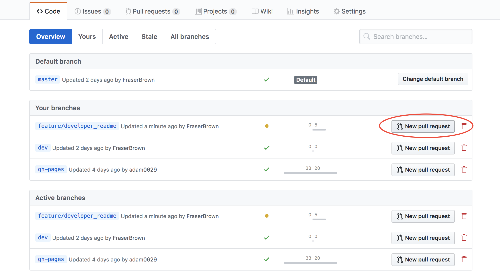

# CRSP-Engine [](https://travis-ci.org/FraserBrown/CRSP-Engine)
#### Continuous RDF Stream Processing Engine (CRSP Engine) using RSPQL

[//]: # (Comment)

Our Continuous RSPQL Stream Processing (CRSP) Engine is a new tool that allows for ***continuous RSP-QL queries*** to be applied over streams of RDF ***graph*** data. 
The primary goal for our system is to be able to run any valid RSP-QL query over any valid RDF graph stream and output the correct result. 

[//]: # (Screenshot of program in use)


## Installation Dependancy Prerequisites:
* Java version: 1.8 - below we will show how to install java 1.8 jdk on Linux.

### Installing Java JDK 1.8 on Linux
Create java folder in opt and make it your working directory
```sh
sudo mkdir /opt/java && cd /opt/java
```
Download [``java 1.8 jdk``](java-jdl-dl) .tar file

Copy downloaded file into ``/opt/java``
```sh
sudo mv ~/Downloads/jdk-8u161-linux-x64.tar.gz /opt/java
```

Uzip jdk, then remove original zip
```sh
sudo tar -zxvf jdk-8u161-linux-x64.tar.gz
sudo rm -rf jdk-8u161-linux-x64.tar.gz
```

Update your alternatives entry for ``java``, ``javac``, ``jar`` telling the system where they are instlaled.
```sh
sudo update-alternatives --install /usr/bin/java java /opt/java/jdk1.8.0_161/bin/java 100
sudo update-alternatives --config java
sudo update-alternatives --install /usr/bin/javac javac /opt/java/jdk1.8.0_161/bin/javac 100
sudo update-alternatives --config javac
sudo update-alternatives --install /usr/bin/jar jar /opt/java/jdk1.8.0_161/bin/jar 100
sudo update-alternatives --config jar
```

Configure engironement variables:
```sh
export JAVA_HOME=/opt/java/jdk1.8.0_161/
export JRE_HOME=/opt/java/jdk1.8.0_161/jre
export PATH=$PATH:/opt/java/jdk1.8.0_161/bin:/opt/java/jdk1.8.0_161/jre/bin
```

Confirm java setup:
```sh
java -version

# will output:
java version "1.8.0_161"
Java(TM) SE Runtime Environment (build 1.8.0_161-b12)
Java HotSpot(TM) 64-Bit Server VM (build 25.161-b12, mixed mode)
```

## Installation
OSX & Linux & Windows:

```sh
git clone https://github.com/FraserBrown/CRSP-Engine.git .
```

## Running/Using CRSP Engine:
The CRSP Engine comes with a GUI to make interaction with our system easier.

1. To run the GUI please enter the following from the CRSP-Engine folder:
```sh
java -jar out/artifacts/crsp_engine_jar/crsp-engine.jar
```

You should see the following:


2. Please specify a .json file that contains the json structure you want. The json file should be stored in your project folder.

 

3. For the query input you have 2 options :
	- specify the text file containing the query. The text file should be stored in your project folder (same folder as your json file)
	- manually input the query in the "Query String" box

 

4. Specify the name for the output file where you wish your results to be saved. The file itself will be created and saved in the project folder (same folder as the json file).

5. Once you have setup the desired input, press the "Process Query" button. This will process the received input, create the output file and store the output in it as well as printing the output in the "Query Results" box.

 

## Contributing

### Git Branch Naming Convention
Depending on the type of contribution you are making please name your branch with one of the following tags in this format (TAG/your_feature_name)
- feature
- hotfix
- bugfix

### Git Project Workflow
This project uses a git-branch based workflow, we have 3 main branches
* ``master`` - This holds stable code that are treated as releases.
* ``dev`` - This holds current development build, all development bugs, features and hotfixes are branched from ``dev``
* ``gh-pages`` - Source code for our github pages website

### Setting Up Git
1. Clone our code, and checkout our dev branch
```sh
$ git clone https://github.com/FraserBrown/CRSP-Engine.git
$ git checkout dev
```

2. Create new ``branch`` from the ``dev`` branch
```sh
$ git checkout -b your_tag/your_branch_name dev
```

3. Develop your code, commit code, and push changes to your new branch

>**NOTE:** Your first push of your to your branch with new changes will have to be in the following format:
>```sh
>git push -u origin your_tag/your_branch_name
>```

4. When development is complete create a pull request
    * Select `` New pull request`` on your newly developed branch from the ``branches`` tab
        
    * Select ``base:dev`` as the branch you wish to eventually ``merge`` to and fill out the form details, pressing ``Create pull request`` when finished.
        
    * Your branch will be reviewed by the maintainers.

### Development Environment
#### Packages used in this project
The below packages will be installed through maven automatically for you:
* [RDF4J](http://rdf4j.org/) - Framework for processing and handling RDF data
* [GSON v2.3.1](https://github.com/google/gson) - JSON to Java Object Parser 
* [JUnit v4.12](https://junit.org/junit4/) - Testing Framework
* [TravisCi](https://travis-ci.org/) - Continuious Integration software used in the git repository.

#### Set up Eclipse
##### Pre-Requisites:
1. Install JDK1.8 as shown in [Installing Java JDK 1.8 on Linux](#Installing-Java-JDK-1.8-on-Linux).
2. ``Clone`` the repository and set you your new ``branch`` as per [contributers setting up git](#Setting-up-git).
3. Install Eclipse
##### Import Poject into Eclipse:
1. ``Open Eclipse`` and enter the ``path`` to the parent diretory of the previously cloned repository.
2. Once eclipse has started select ``File --> Import``
3. Select ``maven --> Existing Maven Projects`` then click ``next``

    

4. Browse to the newly created project, select the pom file from box, click ``Finish``

    

The project should import dependencies will be downloaded through the pom file and maven in the background. You will can now start developing.

## Testing Environment
The testing environment in this project is done through JUnit, tests can be found in: ``CRSP-Engine/src/test/java/``. Our test naming scheme uses the following format; ``*Test.java`` where ``*`` is the name of the feature or system element you wish to test.
Some examples include:
* RSPQLParseTest.java

To run all the test in to perform regression testing (testing your new feature has not broken any existing functionality):
1. Open Eclipse or your IDE of choice
2. In the ``project pane`` (on the left hand side) right click on the directory ``test/java`` then select ``Run All Tests``.

## Continious Integration
Out git repository uses continiuous integration in the form of TravisCI. This runs a clean build and any tests in the ``src/test/java/`` directory when ever a new change is pushed to a branch.


<!-- Markdown link & img dfn's -->
[java-jdk-dl]: http://www.oracle.com/technetwork/pt/java/javase/downloads/jdk8-downloads-2133151.html
[json-graph-stream]:https://raw.githubusercontent.com/streamreasoning/RSP-QL/gh-pages/Example_RDF_Streams/BGN_Location_TempC_Minute_Unioned.json

## List of Current Contributers:
* [Fraser Brown](https://github.com/FraserBrown)
* [Adam Dalley](https://github.com/adam0629)
* [Teodor Mihai](https://github.com/Mihaiteodor95)